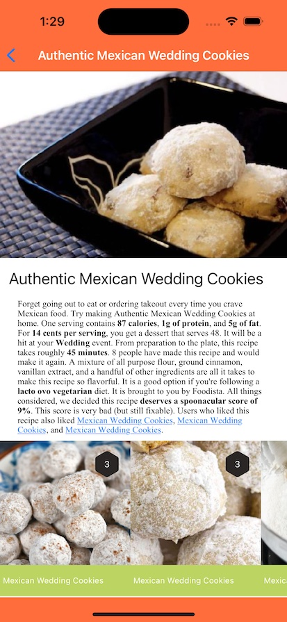
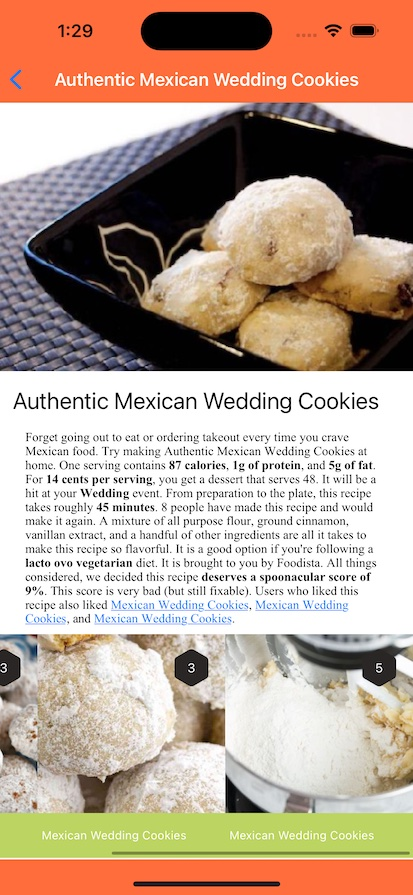
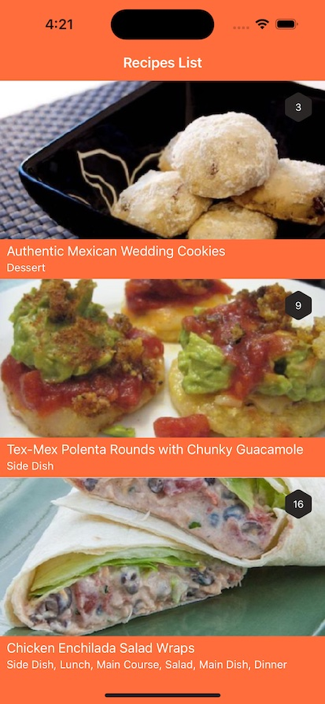
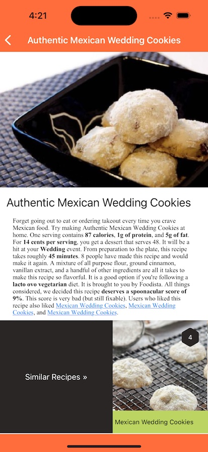
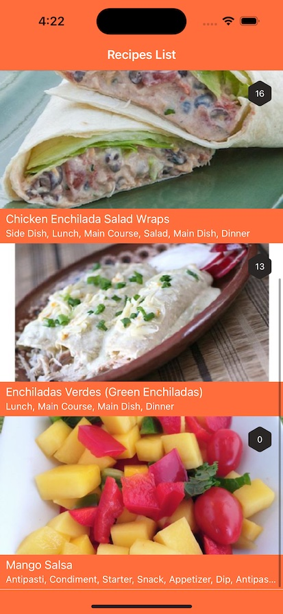
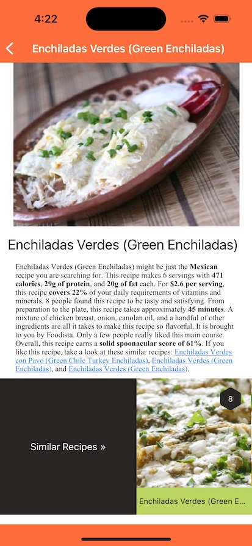
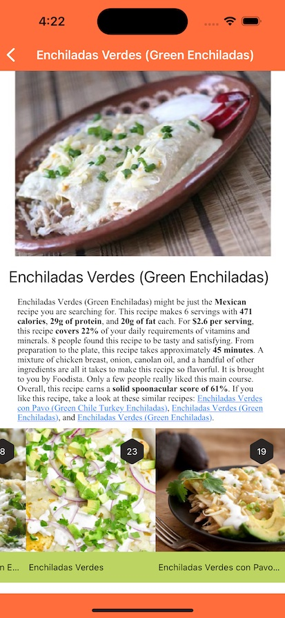
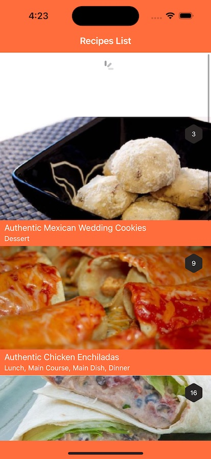
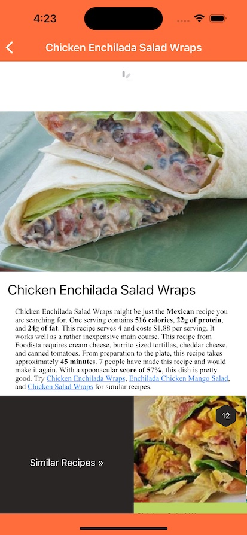

# Recipes App

* MVVM Demo
* Combine API Client
* Programmatic Autolayout

## Set Up

Add a [Spoonacular API KEY](https://spoonacular.com/food-api/faq?faq-query=api%20key) to `Recipes/Config.xcconfig` ex. `API_KEY = asdfgfoobarbaz`

## Considerations

iOS 15+

## Screenshots

